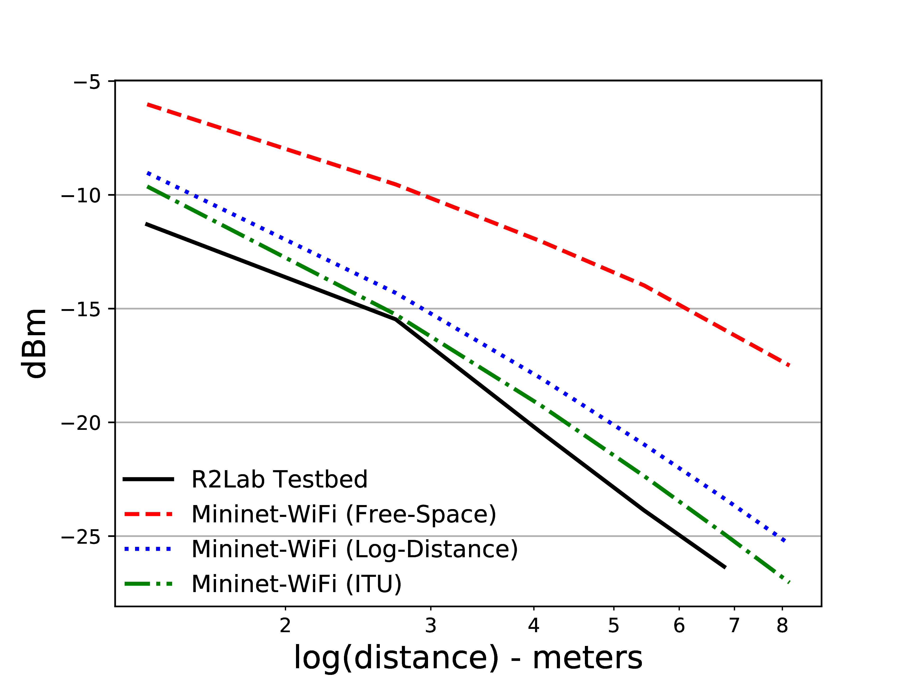
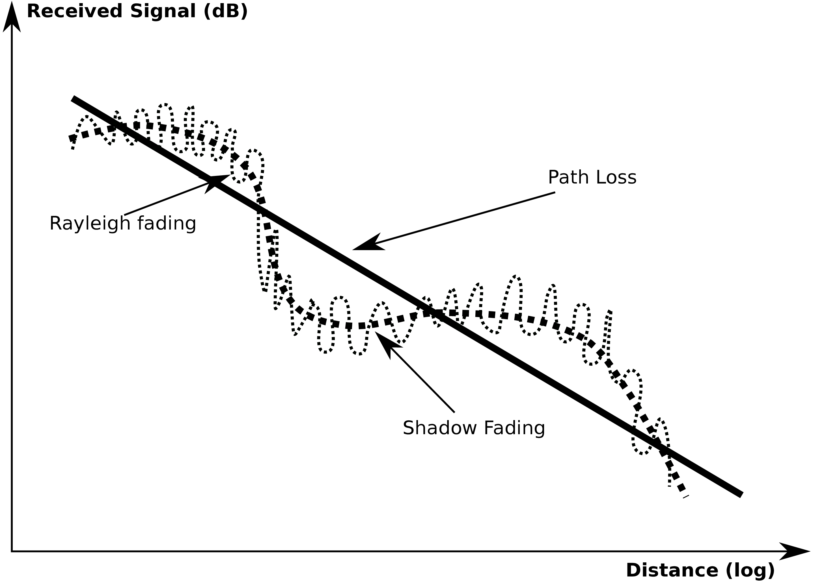
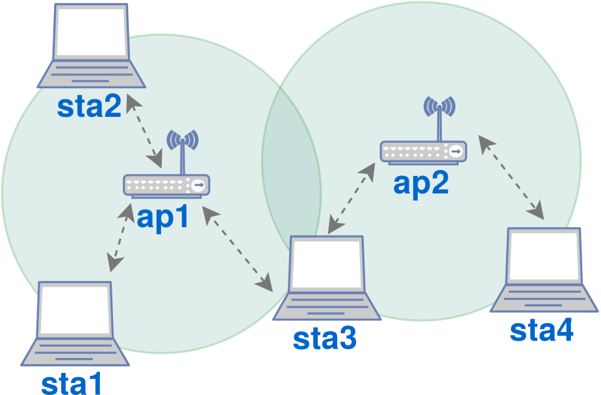
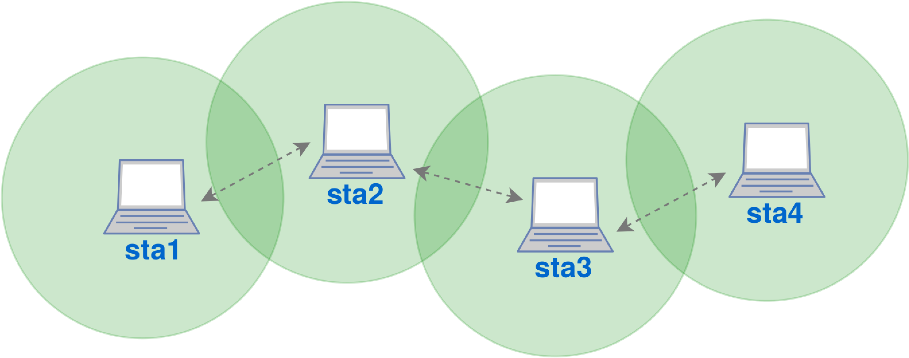
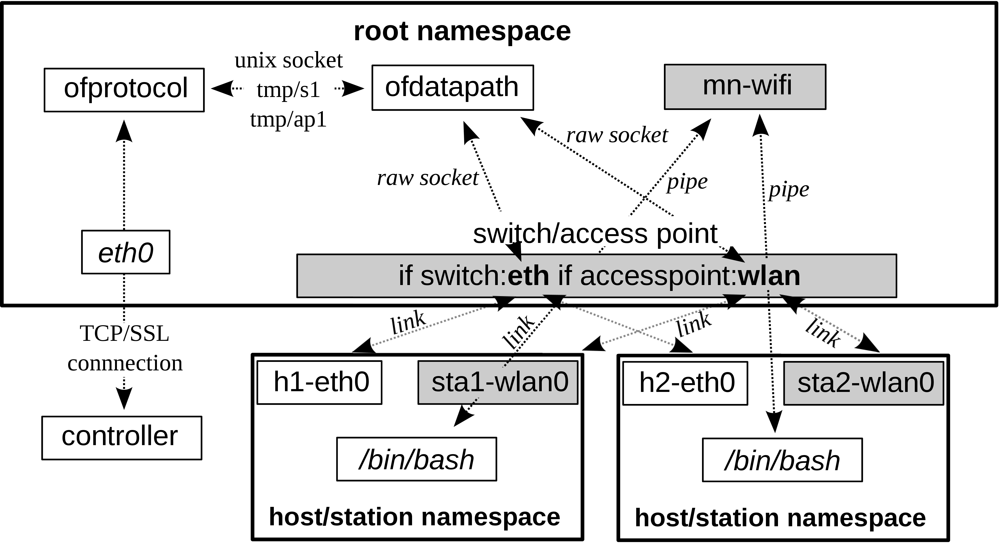
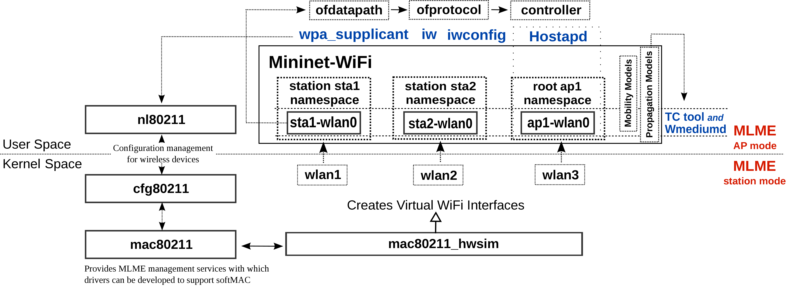

## Background

## Wireless communications

Wireless communications continues to be one of the most vibrant fields in the telecommunications sector. Although they began in the late nineteenth and early twentieth centuries, wireless communication research and development activities intensified between the 1970s to 1990s, fueled by a growing demand for increasingly better connectivity. Initially driven by the development of cell phones for voice services and then data applications, wireless technologies keep evolving, fostered by new forms of content creation and consumption and interaction between humans, machines and everyday objects, a trend commonly known as the Internet of Things (IoT).


Conventional wireless communication networks encompass several elements, the most basic of which are listed below: (i) the wireless terminals - such as laptops, smartphones, which are the interface between the user and the network; (ii) radio links, which connect the terminals to an agent providing the network coverage service; (iii) base stations, which function as the coverage agents; (iv) switching and control centers, which concentrate the base stations and connect them to other communication services.


RSSI. Source: cite{DBLP:journals/cj/FontesMDTR17}


There are numerous technologies that provide wireless services, such as Bluetooth, LTE, Zigbee, WiFi, among other means. Wireless communications have unique features that make them distinct from other technologies. One of them, and certainly the most important one, is the propagation of radio waves. A signal propagating from one point to another undergoes three types of phenomena, namely: attenuation, long-term fading and short-term fading. Attenuation refers to loss of transmission when the receiver moves away from the source. Long-term fading refers to conditions when the average signal changes slowly over time due to obstructions to the signal path, such as buildings, trees, etc. Short-term fading refers to quick fluctuations of the signal due to reflection, scattering and diffraction. There is also the problem of interference by services using the same frequency or even approximate frequencies.


Due to the increasing worldwide demand for wireless communications, new technologies are emerging so that systems can meet this demand. In any case, the development of any system, and, more specifically, wireless systems, requires a deep knowledge of the phenomena involved. Figure below exemplifies the phenomenon of path loss by showing how the Received Signal Strength Indicator (RSSI), in dBm, oscillates in relation to the physical distance between a base station and a wireless station. The figure compares the estimations of different propagation models described in the literature (_Free-Space, Log-Distance, ITU}) - which are available in the Mininet-WiFi emulator - compared to measurements taken in a laboratory environment, the  [R2Lab](https://r2lab.inria.fr) testbed. Figure below, in turn, illustrates the phenomena of long-term and short-term fading.




- H. Waldman e M. D. Yacoub, _Telecomunicações: Princípios e Tendências_, Editora Érica, 1997. ISBN: 978-8571944374
- J. C. de Oliveira Medeiros. _Princípios de Telecomunicações. Teoria e Prática_. Editora Érica, 2015.  ISBN: 978-8536516288
- M. D. Yacoub, _Foundations Of Mobile Radio Engineering_. CRC  Press, 1993. ISBN: 978-0849386770
- M. D. Yacoub, _Wireless Technology: Protocols, Standards, and Techniques_, CRC Press, 2001. ISBN: 978-0849309694
- C. J. Weisman, _The Essential Guide to RF and Wireless_. Prentice Hall. 2002. ISBN: 978-0130354655
- T. Rappaport, _Wireless Communications: Principles and Practice_, Pearson Education India, 2010. ISBN: 978-0130422323
- A. K. Jagannatham, _Principles of Modern Wireless Communication Systems Theory and Practice_. McGraw Hill Education, 2017. ISBN: 978-1259029578


## WiFi: IEEE 802.11-based wireless local area networks

Established by the Institute of Electrical and Electronics Engineers (IEEE), IEEE 802.11 is the most accepted wireless communications standard in the world. WiFi technology, as it is most commonly known, is the Wireless Local Area Network (WLAN) technology based on IEEE 802.11, and it is a trademark of the Wi-Fi Alliance. The reasons for the wide acceptance of this pattern are diverse, but the main justification is cost-performance ratio.\\


As illustrated in the figure above, there are several 802.11 standards, such as the older 802.11b, 802.11a, and 802.11g versions, and other versions that may be considered as newer, such as 802.11n, 802.11ac, 802.11p, and so on. In general, the standards defined for 802.11 operate on two main frequencies: 2.4 GHz or 5 GHz. In the example given by ref{fig:canais-wifi}, it can be seen how the 802.11b standard defines 13 channels on the 2.4 GHz band at 2.4835 Ghz, allocating 22 MHz for each channel, with a spacing of 5 MHz among them. With this arrangement, only channels 1, 6 and 11 can operate without band overlap.\\

IEEE 802.11b channels. Source: adapted from cite{BinNgadi2012}~(CC BY 2.0)")

The Bit Error Rate (BER), which is a requirement to be fulfilled in the system design, can be determined by knowing the modulation scheme, the type of encoding and the signal-to-noise ratio (SNR). It is known that an increase in transmitter power results in a higher SNR and a consequent decrease in BER. Obviously, power cannot be increased indefinitely, due to interference and to power limitations in the transmitter itself.


Table below compares different 802.11 standards in terms of operating frequency, channel bandwidth and coverage radius estimates in indoor and outdoor environments. 

| **Protocol** | **Freq. (GHz)** | **Bandwidth (MHz)** | **Internal Signal Range** | **External Signal Range** |
|------------------|---------------------|--------------------------|--------------------------------|--------------------------------|
| 802.11           | 2.4                 | 20           | 20 m / 66 ft      | 100 m / 330 ft                 |
| 802.11a          | 3.7/ 5              | 20           | 35 m / 115 ft      | 120 m / 390 ft                 |
| 802.11b          | 2.4                 | 20           | 35 m / 115 ft      | 140 m / 460 ft                 |
| 802.11g          | 2.4                 | 20           | 38 m / 125 ft      | 140 m / 460 ft                 |
| 802.11n          | 2.4/5               | 20 - 40     | 70 m / 230 ft      | 250 m / 820 ft                 |
| 802.11ac         | 5                   | 20/40/80/160 | 35 m / 115 ft      | n/d                            |
| 802.11ad         | 60                  | 2,160        | 60 m / 200 ft      | 100 m / 300 ft                 |
| 802.11ay         | 60                  | 8000        | 60 m / 200 ft      | 1000 m / 3000 ft               |


Table below compares 802.11n and 802.11ac, two of the newer standards that incorporate recent advances in wireless communications, such as spatial flows based on MIMO (Multiple Input Multiple Output).\\


|                                  | **IEEE 802.11n**      | **IEEE 802.11ac** |
|----------------------------------|-----------------------------------------------------------------------------------------|-------------------------------------------------------------------------------------|
| Frequency                           | 2.4 GHz \   5 GHz                                                         |            5 GHz                                                            
| MIMO                                | Single User (SU)                                                   | Multi User (MU)                                                |
| Spatial Flows   | 4                      | 8                                                              |
| Taxa PHY                                      | 600 Mbps                                                           | 6.9 Gbps                                                       |
| Channel Width   | 20 or 40 MHz                                                       |20, 40, 80, 80-80, 160 MHz
| Modulation                                              | 64 QAM                                                             | 256 QAM                                                        |
| Flow rate  MAC* | 390 Mbps                                                           | 4.49 Gbps                                                      |


The 802.11 architecture consists primarily of an access point and a number of wireless stations (clients). In this case, the architecture is defined as Basic Service Set (BSS), or infrastructure mode. In contrast, 802.11 networks composed of only wireless stations (clients) are referred to as Independent Basic Service Set (IBSS) or ad-hoc mode. The graphical representations of these two architectures (or modes of operation) are illustrated in Figures below.


As is true with Ethernet devices, each 802.11 wireless device has a 6-byte MAC address stored on the network interface card. It is through the wireless network interface that stations can associate with an access point or even other client stations before receiving or sending 802.11 frames.






Because wireless networks do not have the physical means to prevent collisions, these do happen even with the most advanced wireless technologies. While the IEEE 802 standards for Ethernet family cabling enable Collision Detection (CD), wireless networks have no means to detect a collision. The strategy adopted by the 802.11 standards to handle wireless access control is known as Carrier Sense Multiple Access with Collision Avoidance (CSMA/CA).


When the CSMA/CA method is used, each station informs about its own transmission intent and the associated time for Collision Avoidance (CA). The stations, which are equipped with wireless interfaces, listen to the medium using wireless interfaces to verify the presence of signals (signal level at the carrier frequency) and wait until the medium is clear before transmitting. These mechanisms are known as Request to Send (RTS) and Clear to Send (CTS).


Despite the similarities between Ethernet frames and 802.11 frames, there are several fields that are specific to wireless links. The fields in the 802.11 table are shown in the figure below. The numbers above each field in the frame represent their lengths in bytes, while the numbers above each of the sub-fields in the frame control field represent the lengths of the sub-fields in bits.\\


Although we do not go into detail about the function of each of the fields and sub-fields belonging to frame 802.11, it is advisable to know about them even if superficially. These fields may be useful for further exploration of some of the tutorials that will be presented throughout this book.

#### The future of WiFi
Although wireless networks are very important, there are still structural barriers that prevent their innovation, even with regard to WiFi itself. Furthermore, large wireless infrastructure is not completely accessible because there are restrictions on its use or authentication requirements. Namely, the issue here is not to open access to wireless networks completely and freely, but to allow users to connect to multiple networks (preserving security and quality standards), thus opening up a huge capacity for coverage and enabling continuous innovation, as proposed by cite{santos6733664}.


Nevertheless, there are already several studies on vehicular networks and also the Internet of Things that use WiFi in their methods. Many of them, of course, provide only suggestions for improvements that may advance 802.11 in the future. Yet it is not for nothing that researchers already speak of 802.11ax, an evolution of 802.11ac that promises to connect more devices with higher baud rates than its predecessor.


Among the proposals for improvements and advancements in wireless networks and especially WiFi, is the concept of software-defined wireless networks, which also promises significant progress by constructing a new idea of connectivity. Therefore, along with the concept of software-defined wireless networks, this book will present a series of tutorials that will explore various cases involving Mininet-WiFi. Mininet-WiFi is the wireless emulator that we will use extensively throughout this book. It was developed with the aim of providing an environment capable of supporting research on wireless networks and software-defined wireless networks, enabling innovations to be developed for the most diverse wireless technologies.

- Matthew S. Gast._ 802.11 Wireless Networks: The Definitive Guide}. O'Reilly Media, 2005. ISBN-13: 978-0596100520
- Matthew S. Gast. _802.11ac: A Survival Guide: Wi-Fi at Gigabit and Beyond}. O'Reilly Media (Edição: 2), 2013. ISBN-13: 978-1449343149
- Jim Geier, _Designing and Deploying 802.11 Wireless Networks: A Practical Guide to Implementing 802.11n and 802.11ac Wireless Networks For Enterprise-Based Applications}. Cisco Press, 2015. ISBN-13: 978-1587144301
- IEEE 802.11 Wireless Local Area Networks. The Working Group for WLAN Standards. Available at: \url{http://www.ieee802.org/11/}


## Software-defined wireless networking
Software-defined wireless networking (SDWN) cite{Jagadeesan:2014:SNP:2658850.2655690,Costanzo12_SDN} is an approach that allows centralized control of the network through the use of programs that do not necessarily have to be located in access points. Thus, rules defined by these programs (commonly known as controllers) dictate the behavior of the network. The principles of SDWN, which separate the control plane from the data plane, are very similar to those of software-defined networks (SDN) cite{DBLP:journals/corr/KreutzRVRAU14}.


The software-defined approach allows network administrators to specify network behavior in a logical and centralized way. To do so, they use programs provided by control platforms that implement southbound interfaces on network devices such as switches. In this context, the OpenFlow protocol cite{McKeown:2008:OEI:1355734.1355746} is the most popular southbound interface. However, there are other viable interfaces, such as CAPWAP cite{rfc4564}, FORCES cite{rfc5810},  NETCONF cite{rfc6241}, etc.\\

High-level and generic architecture for SDWN. Source: Adapted from cite{DBLP:journals/cj/FontesMDTR17}


Due to the increased interest of mobile operators cite{citeulike:13432184,DBLP:journals/cm/SamaCKAQN15}, mainly in Network Function Virtualization (NFV) cite{7045396}, SDWN has become a branch of software-defined networks of considerable interest to the scientific community. The separation between the control plane and the data plane is not new in the history of wireless networks. The IETF standardized both the LWAPP (Lightweight Access Point Protocol) and the CAPWAP (Control and Provisioning of Wireless Access Points) many years ago by issuing RFC5412 cite{rfc5412} and RFC4564 cite{rfc4564}, respectively - even before the development of software-defined networks and the OpenFlow protocol.


Many companies use wireless network management systems by means of protocols such as LWAPP and CAPWAP. LWAPP defines message control for configuration, authentication and other operations, while CAPWAP is based on LWAPP and allows a controller to manage different access points.


The number of studies on software-defined wireless networks has grown significantly in recent years. It is worth reading cite{Jagadeesan:2014:SNP:2658850.2655690} for a more comprehensive survey, in addition to some software projects, such as: OpenRoads cite{Yap:2010:BII:1851399.1851404}, Odin cite{Suresh:2012:TPE:2342441.2342465}, OpenRF cite{Kumar:2013:BCM:2486001.2486034}, Ethanol cite{DBLP:conf/im/MouraBVM15}. Architectures such as CloudMac cite{citeulike:13252824} and Chandelle cite{citeulike:13252823} use CAPWAP in their code. CloudMac describes wireless network management protocols, such as CAPWAP, as difficult to be configured with new features, since access point controllers that use CAPWAP are mostly proprietary systems. Chandelle, on the other hand, proposes a migration between smooth and fast access points using SDN/OpenFlow, but faces integration issues with regard to traditional switches and CAPWAP.


 It is important to mention that there is an open source implementation of the CAPWAP protocol that is compatible with RFC 4515 and RFC 4516, called OpenCAPWAP  cite{Agostini2016}, whose development started in 2015 (\url{https://github.com/vollero/openCAPWAP}).

The benefits of integrating wireless networks with OpenFlow generally involve centralized management and monitoring, unified policies, greater scheduling, and better control of wireless functions. 


Taking into account these benefits and the limitations associated with CAPWAP, which is likely to be a more robust but closed-source solution, some questions are unavoidable: _``Is CAPWAP compatible with SDWN?''}, _``How to improve the OpenFlow specification, so that it supports centralized management of wireless networks? Or even, could you extend it to wireless networks?''}, _``Are new approaches needed?''} or _``How much could be recycled from the existing infrastructure?''}.


- L. E. Li, Z. M. Mao and J. Rexford, _Toward Software-Defined Cellular Networks_. European Workshop on Software Defined Networking (EWSDN), 2012. 
- A. Gudipati et al., _SoftRAN: software defined radio access network_. Proceedings of Hot topics in software defined networking (HotSDN). 2013. 
- C. J. Bernardos et al., _An architecture for software defined wireless networking_. IEEE Wireless Communications. 2014.
- T. Chen et al., _Software defined mobile networks: concept, survey, and research directions_, IEEE Communications Magazine. 2015.
- Mao Yang et al., _Software-Defined and Virtualized Future Mobile and Wireless Networks: A Survey_. Mob. Netw. Appl. 2015.
- I. T. Haque and N. Abu-Ghazaleh, _Wireless Software Defined Networking: A Survey and Taxonomy_, in IEEE Communications Surveys \& Tutorials. 2016.
- A. Abdelaziz et al. _On Software-Defined Wireless Network (SDWN) Network Virtualization: Challenges and Open Issues_. Computer Journal. 2017. 
- [Linux Foundation’s Open Networking Foundation (ONF) SDN Wireless Transport.](https://www.opennetworking.org/tag/wireless-transport/)

## Mininet-WiFi

Network emulation has been widely used in performance evaluation, protocol testing and debugging, as well as in a variety of research on computer network architectures. A researcher typically has several possible methods to evaluate and validate research data and network protocols, as well as perform analyses, among other operations.


Simulators, emulators and testbeds are the main evaluation tools that help researchers in their tasks. Still, regarding their practical applications, all these evaluation tools are very different in their degree of abstraction. Some of the experimental platforms that can be used for experimentation with wireless networks are shown in the figure below. In this research field, the emulation of wireless networks - which has peculiar characteristics, especially compared with emulators for wired networks - has to implement node mobility, signal propagation, among other features, to allow experiments with environments that have interference, signal attenuation, etc.\\


We will not go into detail about the differences between experimental platforms, but we can highlight two important features of Mininet-WiFi: (i) it allows the use of third-party tools without modifications to the source code of these tools, and (ii) it uses the actual network protocol stack.


Mininet-WiFi is an emulator for wireless networks that was extended from Mininet, a well-known emulator to researchers working in the field of software-defined networks. Mininet-WiFi has native WiFi support, but other wireless networking technologies can also be simulated in experiments using it. With Mininet-WiFi, the user can virtualize stations and access points and also use existing Mininet nodes such as hosts, switches and OpenFlow controllers. Consequently, Mininet-WiFi also enables the processing of packages using the OpenFlow protocol, an important solution for SDN.

 SoftMAC is a term used to describe a type of wireless network interface in which the MAC Layer Management Entity (MLME), for example, is expected to be managed using software. Mac80211 is a driver API for SoftMAC.

Mininet-WiFi is developed based on the Mininet code and the most used WiFi _driver_ for Linux systems, _SoftMac_. With Mininet-WiFi, the user can choose to use the old Mininet features independently or use the extensions implemented for Mininet-WiFi.


### Architecture
The entire virtualization process of Mininet-WiFi works similarly to Mininet, i.e. it is based on processes that run on Linux network namespaces and virtual network interfaces (see ref{arch}). Linux network namespaces are, in a logical sense, copies of the Linux operating system's network stack, which includes its own routes, firewall rules and network devices. They act as if they were real computers, with the same network properties that a physical computer can have.\\



The behavior of wireless interfaces basically depends on the function they perform, such as, for instance, the case of stations and access points, whose interfaces operate in the managed or master modes, respectively. Just as with a real environment, the stations communicate with access points by a process called authentication and association. By default, each station has only one wireless interface, and more can be added if needed. Once connected to an access point, stations can communicate with traditional Mininet hosts, if they are also connected to the access point. Access points, on the other hand, are responsible for managing stations that are associated with them. 


Conceptually, access points are the same entities as the Mininet switches, but equipped with WiFi network cards operating in master mode. Access points are virtualized in the _hostapd}\footnote{Hostapd (\textbf{H}ost \textbf{A}ccess \textbf{P}oint \textbf{D}aemon) is a user-level software capable of launching a wireless network interface on access points and authentication servers.} daemon, which basically uses virtual WiFi interfaces to provide access point capabilities. Details on the running environment of Mininet-WiFi are discussed below.


### Components



The components comprising the Mininet-WiFi architecture are shown in ref{components}. Communication among them occurs as follows: during its initialization, the module called _mac80211\_hwsim_, responsible for the virtualization of WiFi network cards, is loaded with the number of virtual wireless interfaces required for all nodes previously defined by the user. Located in the kernel space of the Linux operating system, all features supported by _mac80211\_hwsim_ come from mac80211, a framework based on _SoftMAC_ that developers use to write drivers for wireless devices.


Also in the kernel space is _cfg80211}, which is an 802.11 heap configuration API for Linux systems. Its configuration is done by running _nl80211}, which also performs the interaction between kernel and user spaces.


The main network applications used by Mininet-WiFi are in the user space. Among them is _hostapd_, whose function is to provide access point services; the TC and Wmediumd programs, which will be described below; _iw_, _iwconfig_ and _wpa\_supplicant_. The latter is used for, among other tasks, WPA/WPA2 authentication.


#### Interacting with the emulation environment

Mininet-WiFi also maintains the same interaction structure as Mininet. E.g., commands such as those shown below can be used, respectively, for connectivity tests or to measure th bandwidth between two nodes. If you are already familiar with Mininet, this is certainly nothing new.

```
    mininet-wifi> sta1 ping sta2 
    mininet-wifi> iperf sta1 sta2 
```


In addition to these, other commands exclusive to Mininet-WiFi can be used for a better experience with the WiFi environment, such as the ones described below: 


```
    mininet-wifi> sta1 iw dev sta1-wlan0 scan
    mininet-wifi> sta1 iw dev sta1-wlan0 connect ssid-ap1
```

These commands allow you to scan WiFi networks and connect to one of them, respectively. Scripts such as _iw_, the command used above, are natively supported by most Linux operating systems and have not been ported or modified to work on Mininet-WiFi. Mininet-WiFi can execute any command and/or program that runs on Linux distributions, such as Ubuntu.

- Ramon dos Reis Fontes, Samira Afzal, Samuel Brito, Mateus Santos, Christian Esteve Rothenberg. _Mininet-WiFi: Emulating Software-Defined Wireless Networks.} In 2nd International Workshop on Management of SDN and NFV Systems 2015. Barcelona, Spain, Nov. 2015. cite{7367387}
- Ramon dos Reis Fontes, _Mininet-WiFi: Emulation Platform for Software-Defined Wireless Networks}. Tese de Doutorado em Engenharia Elétrica,  FEEC/UNICAMP, Jun. 2018. Available at: \url{http://repositorio.unicamp.br/jspui/bitstream/REPOSIP/332708/1/Fontes_RamonDosReis\_D.pdf}
